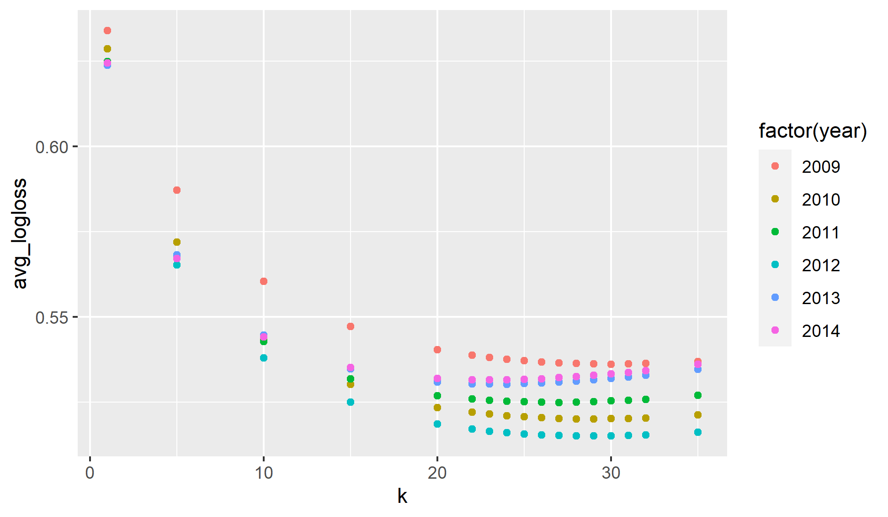
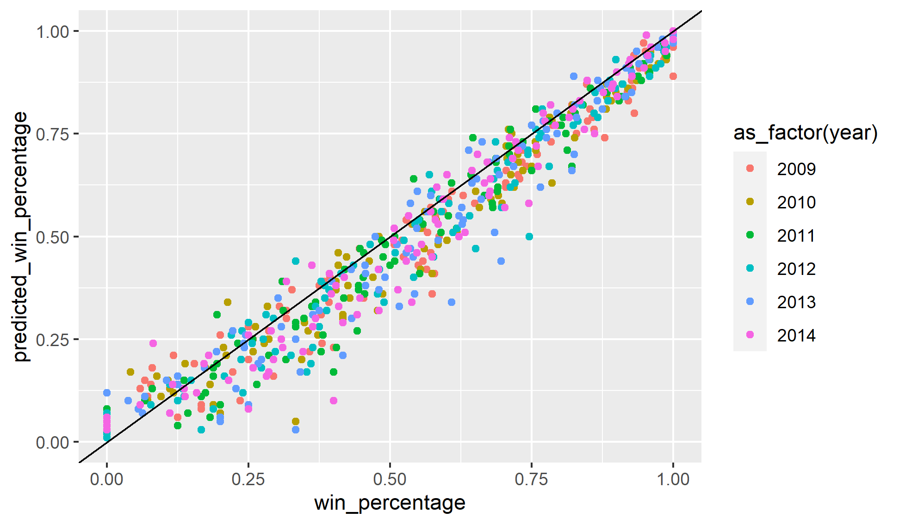
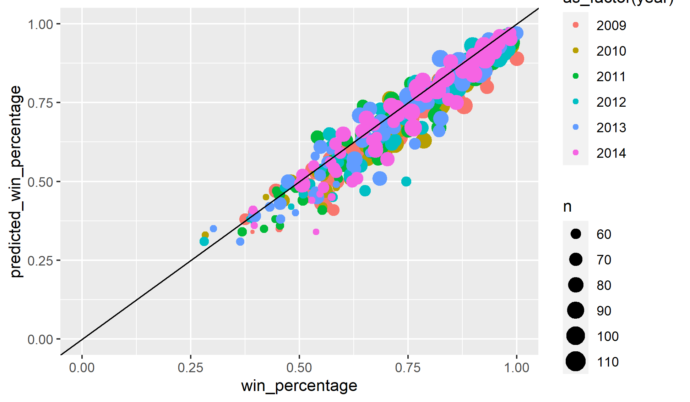

```{r setup, include=FALSE}
knitr::opts_chunk$set(echo = FALSE)
```
## Introduction
My first pass at creating a rating system is using the ever common elo ranking system. You can find a lot about it [online](https://en.wikipedia.org/wiki/Elo_rating_system). Everyone starts at a 1500 rating and then the rating moves up (good) or down based on results. Elo compares the ratings between two opponents and calculates the expected win percentage based on the delta between the teams. For example one team with a rating of 1200 would have the same expected win rate playing an opponent of 1100, as a team ranked 1800 playing one with a rating 1700. After the completion of the game, each teams rating is adjusted. If a team is a heavy favorite, the adjustment is minor, but if an underdog wins the adjustment is large. The winning team always gains rating points, and the losing teams go down. Elo is a zero sum calculation, so the adjustment is the same (one positive and one negative) for both teams.

## Elo Calculation
The calculation for a team winning a game is $$ P_a= \frac{1}{1 + 10 ^ \frac{R_b - R_a}{400}} $$ In this equation $P_a$ is the probability of team a winning the game, $R_b$ is the rating of team b and $R_a$ is the rating of team a. If the game is at one team's home court their rating is increased based on the home court advantage. This will be covered in a later post. The probability for b just flips the $R_a$ and $R_b$ (or you can take $1 - P_a$). Once the game is complete each team's rating is adjusted based on the result. The adjustment equation is $$ R_anew = R_a + K (O_a - P_a) $$ $R_anew$ is the updated ranking for team a. K is a constant that scales the adjustment. The larger K is the more dependent the rankings are on the most recent results, and thus would be more elastic. The goal is to chose a k that reflects team's skill throughout the year, but does not cause wild swing in a team's ranking. $O_a$ is the outcome for team a. Since basketball only has loss and wins, a win is 1 and a loss is 0. $P_a$ is the probability of winning and that equation is shown earlier in this example.

### Example Calculation
Here I will run through an example to explain how the works. Say Montana (team A, rating: 1500) is playing Montana State (team B, rating: 1600) on a neutral court. If one team was home their rating would be increased by the home court advantage amount. Montana would have a win probability, or expected outcome of $\frac{1}{1 + 10 ^ \frac{1600 - 1500}{400}} = .3599 \approx 36\%$ Not surprisingly inverting those rating give Montana State a probability of ~64%. Obviously, Montana State wins this game, so it is time to adjust the rankings. Assuming k = 27, the adjustment is $$R_anew = 1500 + 27 (0 - .3599) \approx 1490.28$$ $$R_bnew = 1600 + 27 (1-.6401) \approx 1609.72$$ Both teams ratings moved by 9.72. If Montana had one the adjustment would have been 17.28 in the other direction for each team. There is a little more to the adjustment to make it more accurate, but that is covered in a later post. 

### Preseason Ratings
To start the beginning of each year we have to adjust the end of season ratings. Because we are not factoring individual players into the team's rating, we don't factor in graduation, transfers, new recruits, or expected player development. For this simple system we just use the last two year's ranking and a little regression to the mean. The current adjustment is taking 50% for the end of year ranking, 30% their previous year ranking, and 20% the mean (1500).
## Checking the Accuracy
I am using two measures to check the accuracy of my predictions and help choose the best k value. Those are log loss calculation and by bucketing the results by expected outcome. 

### Log Loss
Log loss is a calculation that compares expected result to actual result. It penalizes overconfidence. Without going into the gory details (more can be found [here](https://www.analyticsvidhya.com/blog/2020/11/binary-cross-entropy-aka-log-loss-the-cost-function-used-in-logistic-regression/) and [here](https://analyticsindiamag.com/all-you-need-to-know-about-log-loss-in-machine-learning/)) if we said every game was a 50-50 coin flip the log loss would be .693, so we want to have a value lower than that to say our ranking is adding value. The plot below calculated log loss over multiple season on a range of k values. It appears to be lowest in the 25-30 range.

```{r layout="l-body"}

```

Looking at just the 25-30 range we see we are consistently beating the .693 value. Below is table with each year color coded. Blue is the lowest an red is the highest (worst). As you can see the value of 27 is pretty consistent across the board so that is what we are going to use.

```{r, eval = TRUE}
library(tidyverse)
library(vroom)
library(fs)
library(gt)
library(gtExtras)

df <- vroom("logloss.csv")
df %>%
  gt() %>%
  gt_color_rows(`2009`:`2014`, palette = "ggsci::default_gsea")
```
### Bucketed Results
Now that we have optimized k for log loss value, the next thing is to confirm the results are roughly linear. If we say a team has a ten percent chance of winning they should win roughly 10% of those matchups. If each group wins as much as expected through the probability it tells us the model is calibrated accurately. As you can see in the plot below the results overal show a very linear result. This means the model is calibrated well. The x-axis is the actual results, and the y-axis is the predicted result. For example it takes all games that gave a team a 75% chance of winning and calculated what percent of games we actually won by those teams. The top plot shows all results, and the bottom ones limits to predictions that have at least 50 games.The predicted result is a slightly low on average, so that is something we will have to evaluate in the future to see if can be improved.

```{r layout="l-body"}

```


```{r layout="l-body"}

```
## Conclusion
I created my first pass at ranking NCAA men's basketball team and predicting the results of games. The last thing we want to check is how the k values works over time. It is pretty consistent over time, but in the more recent years it has been trending up. We will have to evaluate ways to make it more accurate as the years go on.

```{r, eval = TRUE}
df <- vroom("all_year_logloss.csv")
df %>%
  gt() %>%
  gt_color_rows(logloss,palette = "ggsci::default_gsea")
```
