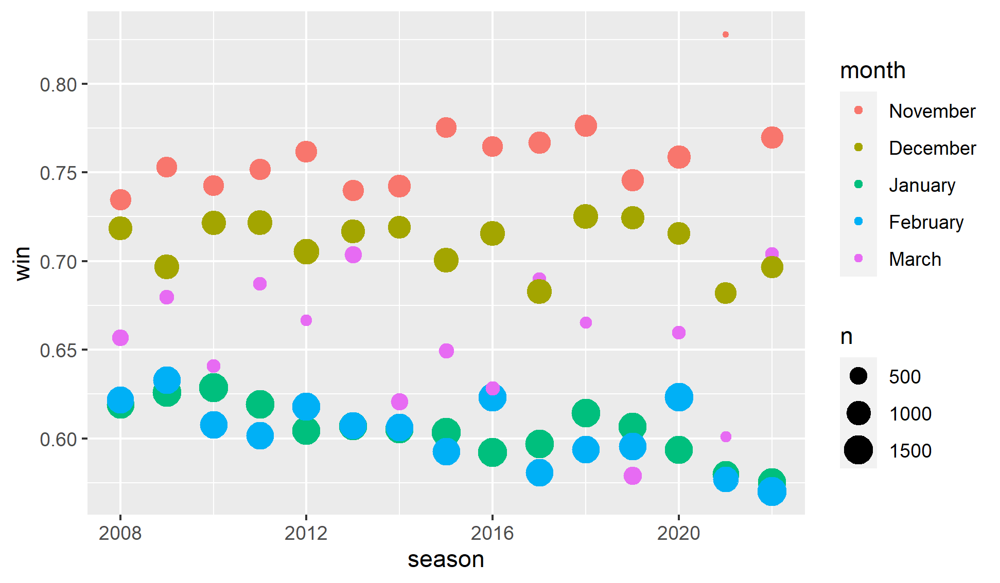

```{r setup, include=FALSE}
knitr::opts_chunk$set(echo = FALSE)
```
# Introduction
Across all sports, the home team tends to win at a higher rate when adjusting for team quality. To properly calibrate our ratings, this advantage must be factored in. We are going to look at a few different ways to calculate the effect playing at home creates.

# Ways To Analyze Home Court Advantage
We will use three different methods to analyze home court advantage. We will discuss the pros and cons of each method to help determine how much playing at home helps.

## All Home Games
The simplest method is calculating the winning percentage of games not played at a neutral site. The table below shows the home court win percentage is around 64-66% for all but the most recent two years. 

```{r, eval = TRUE}
library(tidyverse)
library(vroom)
library(fs)
library(gt)
library(gtExtras)

df <- vroom("homecourt_season_winper.csv")
df %>%
  gt() %>%
  tab_header(
    title = "Home Win Percentage By Year")
```
We could use this as our baseline home court, but I believe this overstates the home court advantage. The reason is each team gets to pick its non-conference schedule each year which can lead to unbalanced results. Good programs will schedule weaker opponents at home to make money and get easy wins. In the professional ranks where the schedule is created to be balanced, looking at home results would be closer to an accurate calculation for home court than in college. Sure enough, if we look at the win percentage by month we see in November and December when non-conference games are played, the win percentage is much higher than in January or February, during conference games. 

```{r layout="l-body"}

```

## Conference Results
The second way is to analyze just conference games. The benefit of this method is the conferences set the schedules to be more balanced. A lot of conferences also have teams playing at each team's home. Also, for the most part, the teams in the conference have similar skill levels to where home court advantage matters more in who wins.

```{r, eval = TRUE}
df <- vroom("conference_season_winper.csv")
df %>%
  gt() %>%
  tab_header(
    title = "Conference Home Win Percentage By Year")
```
These numbers are lower than looking at all home games, as expected. We also see a slight downward trend followed by a large drop during the 2021 season. In the late 2000's home teams win around 62% of games, then the win percentage drops to approximately 60%, and finally to 57% in the two most recent seasons. 

## Home and Away Results
The last way to analyze this is to look at teams that played home and home games and analyzing the overall win percentage. Teams that play home and home are most commonly conference games so the results should be similar to the method above. As the table below shows, this is exactly what we see.

```{r, eval = TRUE}
df <- vroom("repeat_season_winper.csv")
df %>%
  gt() %>%
  tab_header(
    title = "Repeat Home Win Percentage By Year")
```


## Calculating Home Court
The results from conference games and repeat results show a similar home court advantage of around 60% (It is slightly smaller over the last few years). 

```{r, eval = TRUE}
df <- vroom("combined_season_winper.csv")
df %>%
  gt(rowname_col = "Method") %>%
  tab_header(
    title = "Home Win Percentage By Year")
```

Now that we know the benefit of playing at home we need to convert that into an elo rating bump to adjust a team's rating. From the elo rating system, we make some small tweaks to the calculation. We know the home court win percentage is .6 and want to see what that equates to in elo rating. $.6 = \frac{1}{1 + 10 ^ \frac{R_{hc}}{400}}$ Solving for home court advantage gives the below result. $$ R_{hc} = -70.4 $$. This means playing at home is worth a rating boost of about 70 points. The recent year's home court (57%) is around 49 points.


# Future Steps
The above three options are a simple way to analyze home court. It gets you most of the way there without taking further steps to get the last little bit accurate. There are more impacts to consider that could impact the home court advantage.

1. Distance traveled by the road team. The further traveled the more jet lag and other impacts you could see. My assumption is east to west travel is harder than north to south, but will need to confirm.
2. Days spent on the road. Most road trips consist of two games so perhaps being on the second game and away from your bed longer could have an impact.
3. Time of the game. A west coast team playing on the east coast in the afternoon could be earlier than they are used to playing. Similarly, an east coast team playing on the west coast at night might be tired and not at peak performance levels. 
4. Arena specific impacts. A louder crowd might also have an impact. Also if it is a large gym it can impact the visual of the opposing team and cause them to shoot worse. 
5. Season stability. We have already seen home court advantage trending down over time. How quickly in the season can we make a reasonable estimate for the home court advantage that year?

# Conclusions
There are a lot of potential impacts to home court advantage, but by looking at home/away splits we can determine a base rate for home court advantage each year. We see that is around 57-60%, which will help us account for that in predicting each game and adjusting each team's rating. The advantage has been trending down in recent years, so it will be something to keep an eye on in future years.