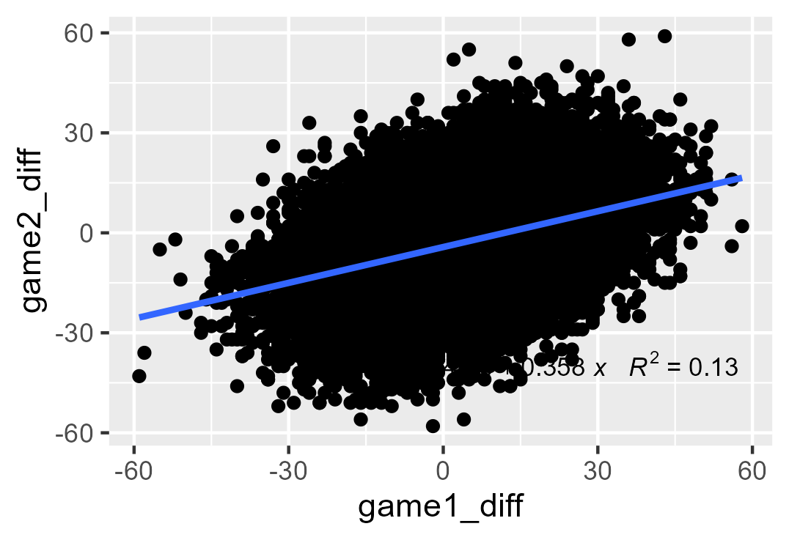
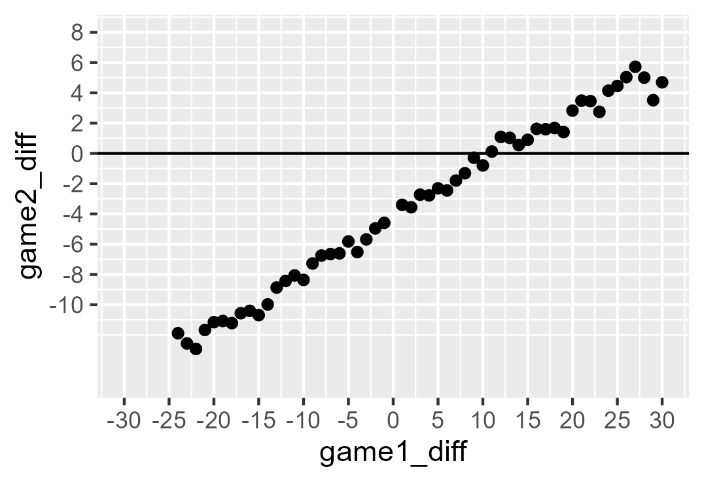
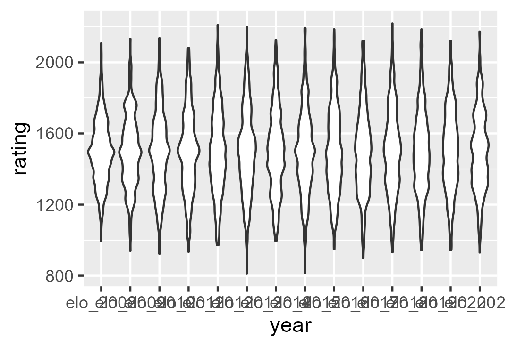
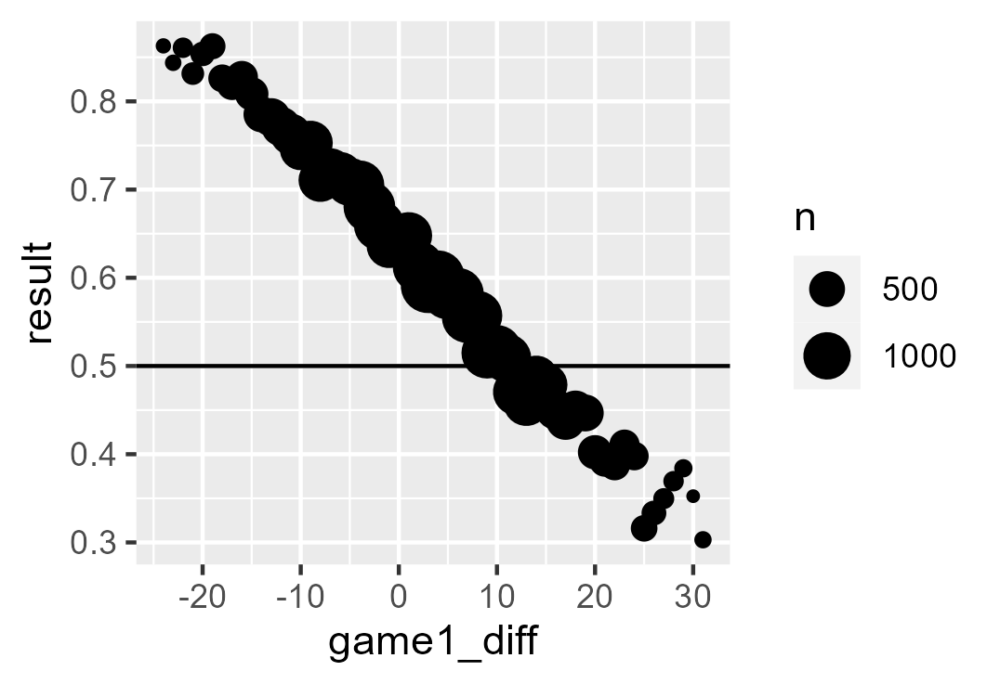
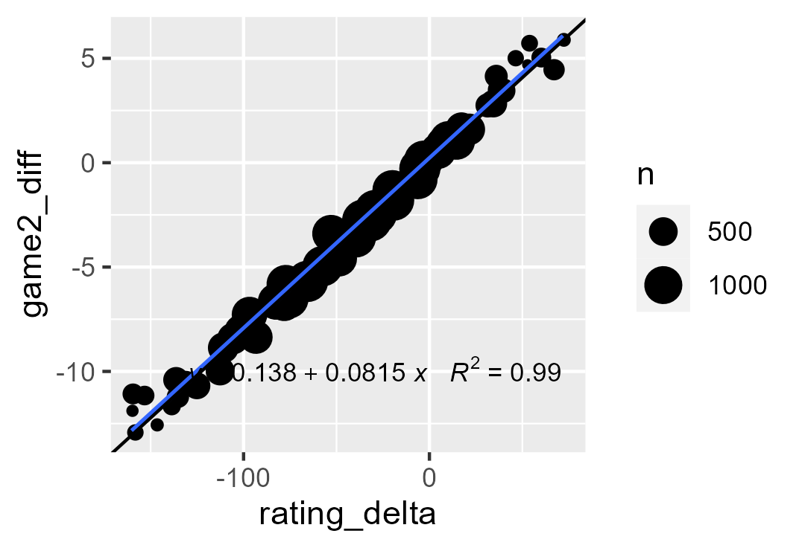
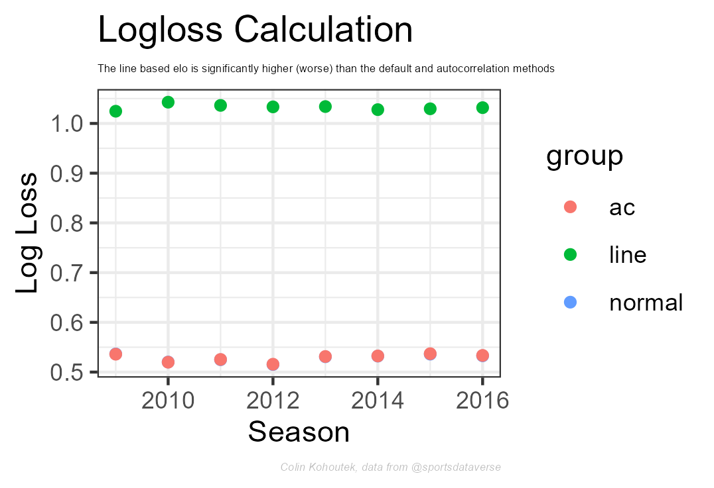
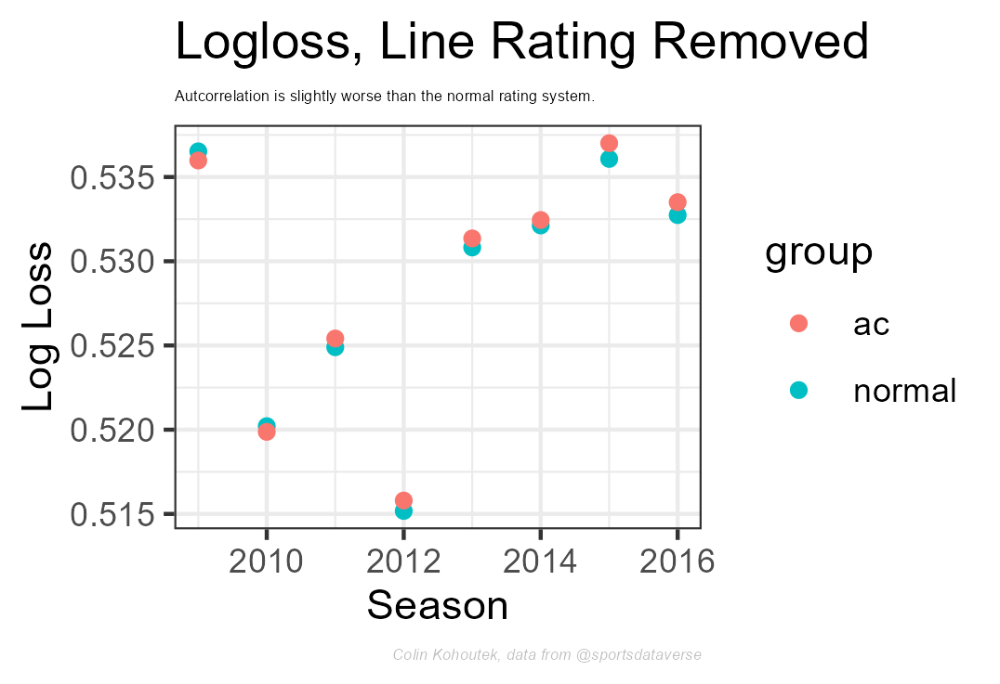

```{r setup, include=FALSE}
knitr::opts_chunk$set(echo = FALSE)
```
# Introduction
Now that we have the basic elo ratings in, it is time to look for ways to improve on them. The base elo algorithm is a good starting point but can be improved. I will look at if incorporating the margin of victory, factoring autocorrelation, and using a line-based elo can be implemented to improve the accuracy of our predictions.

# Margin of Victory
Intuitively it makes sense that the winning margin is a good indicator of team quality. Winning by fifteen is better than winning by five. Before it gets added in I need to prove the impact on games. The best way I can think to do that is to look at teams that play each other twice in a season. Once we get these games we can see how well the scoring margin of the first game predicts the result in the second. To not conflate the home court impact I am going to limit to games that are not at a neutral court.  

```{r layout="l-body"}

```
This plot has a lot of data (17k+ games) so it is hard to tell how much it correlates. It seems to slightly matter, but I am going to compute the mean for the game1 delta and see how that looks.

```{r layout="l-body"}

```
That is a much clearer picture and shows the value of winning by more. It doesn't explain all of the second game score difference as we saw in the previous plot, but if the rankings are going to be as accurate as possible it makes sense to include the margin of victory into our ranking adjustments. I am going to use a log function so the multiplier levels off over time. 

# Autocorelation
The next item is called [autocorrelation](https://en.wikipedia.org/wiki/Autocorrelation). The concern is over time the rating spread can increase. Higher teams win more so they can increase their ranking year over year. This can happen in college sports as teams control the non-conference schedule and so can pad their record with easy wins. We expect the rankings to have a similar spread each year. I am going to run an analysis at the end adding this into the elo rating to see if it improves the prediction accuracy, but a good way to check if I am seeing autocorrelation is to plot the violin plot of each end-of-year ranking. If the rankings spread out over the years, the predictions may need an autocorrelation factor added in. As the plot below shows, the distribution is consistent year to year so I do not expect this to add much to the model's accuracy. 

```{r layout="l-body"}

```

# Line Based Elo
The last method is to adjust the elo difference to a line and adjusting rankings based on who covers the line. To create this rating I need to convert the win percentage, or elo ranking delta, into an expected line. I am going to use the home and home court data above to create this equation. I am going to group the score by the first game score delta and calculate the winning percentage of each group. 

```{r layout="l-body"}

```
I can then use the elo equation to get an expected elo difference. The win probability equation is  $P_a= \frac{1}{1 + 10 ^ \frac{RatingDelta}{400}}$. We can rearrange this to find the RatingDelta based on win probability $RatingDelta = \frac{400*log(\frac{1-P_a}{P_a})}{log(10)}$. 

```{r layout="l-body"}

```
Using this chart and the equations above, we see if the rating delta is 50 points, the team wins 57% of the games and the average margin is about 4.5 points. So instead of using the 57% win probability we set the expected result to 50% and add 4.5 points to the underdog score to see the result compared to the spread.

# Results
To see if these help the accuracy I am going to add them into the base elo calculation and see if the log loss calculation improves (goes down) or not. For the line-based I am using the calculated odds using the rating delta, even though that isn't used in the line-based calculation.

```{r layout="l-body"}


```

The current normal ratings have the lowest logloss and thus are the most accurate predictor year over year. It is interesting that the line-based one is significantly worse. I expected it to be comparable or slightly better. This tells me that winning a game is potentially more important to team quality than solely comparing to the expected game result. I believe performance compared to expectation matters, so I am going to evaluate one more method next time that merges elo and the line-based methods. 

